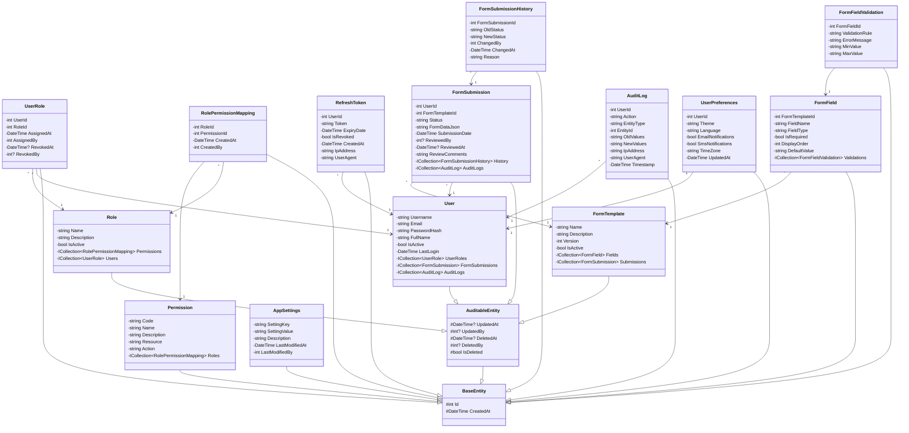
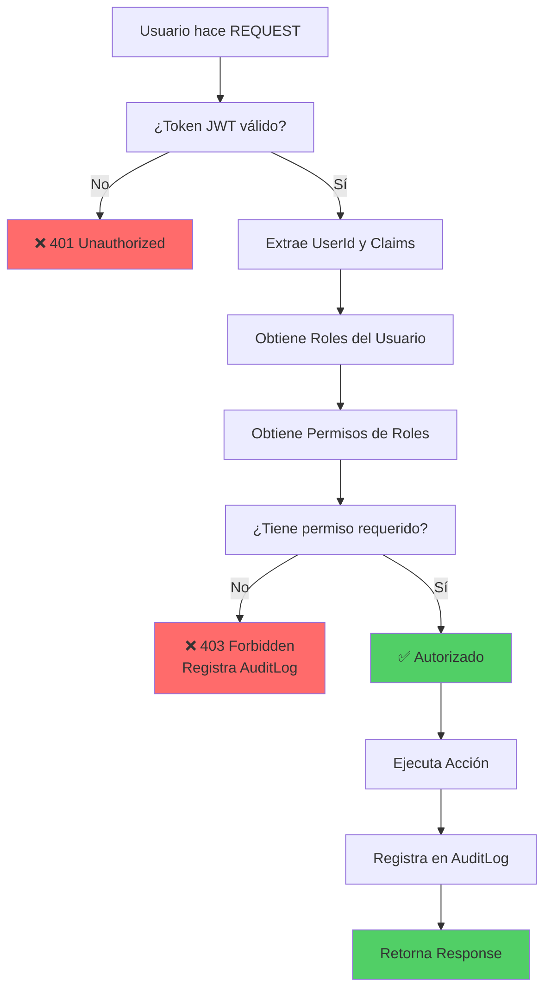
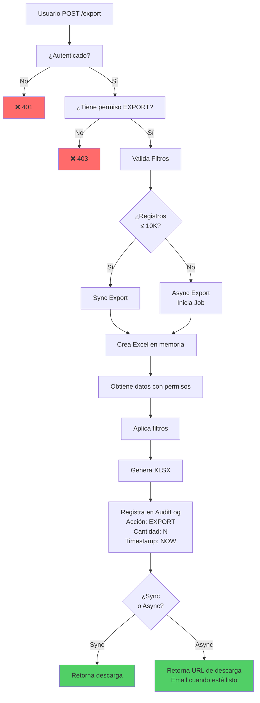
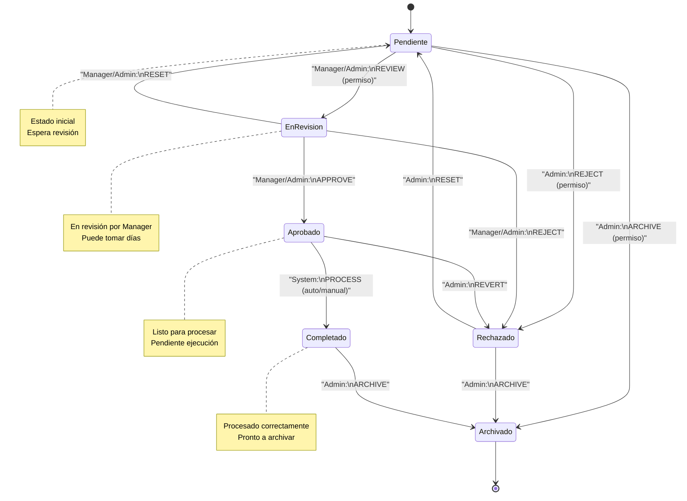
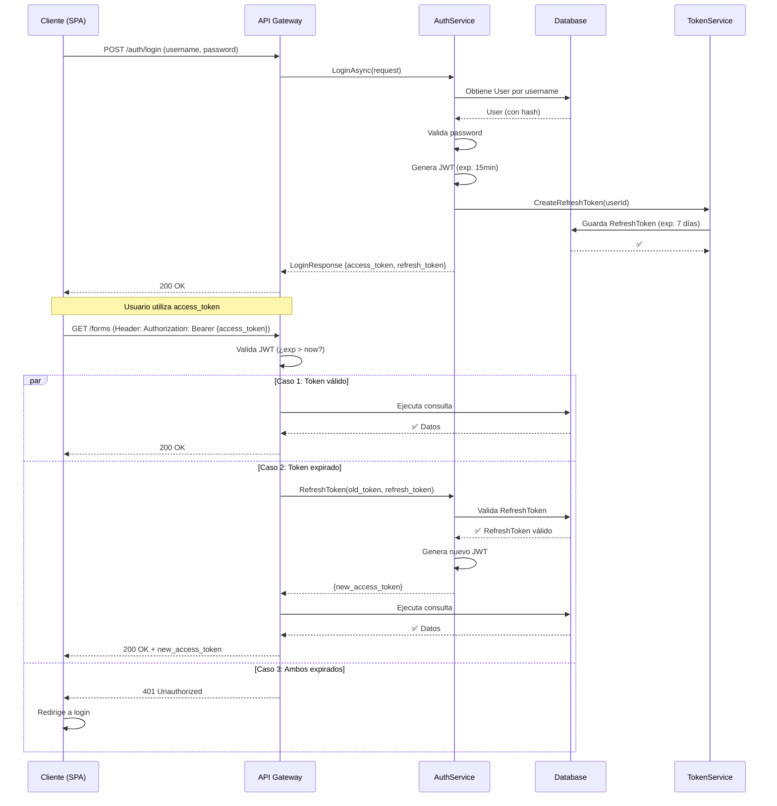

# 📋 ANÁLISIS DE DOCUMENTACIÓN Y DISEÑO ARQUITECTURA RBAC
## AutoCheckAML - Especificación Completa

**Fecha:** Junio 2, 2026  
**Versión:** 1.0  
**Estado:** Plan de Implementación

---

## 📊 TABLA DE CONTENIDOS

1. [Estado Actual del Proyecto](#1-estado-actual-del-proyecto)
2. [Respuestas a Preguntas de Validación](#2-respuestas-a-preguntas-de-validación)
3. [Diagramas Imprescindibles](#3-diagramas-imprescindibles)
4. [Modelo de Datos Propuesto](#4-modelo-de-datos-propuesto)
5. [Patrones de Diseño](#5-patrones-de-diseño)
6. [Seguridad y Auditoría](#6-seguridad-y-auditoría)
7. [Escalabilidad y Performance](#7-escalabilidad-y-performance)
8. [Checklist de Documentación](#8-checklist-de-documentación)
9. [Plantillas](#9-plantillas)
10. [Mejores Prácticas](#10-mejores-prácticas)

---

## 1. ESTADO ACTUAL DEL PROYECTO

### Entidades Existentes (2)
```
User.cs           - Usuario básico sin roles
FormSubmission.cs - Formulario sin workflow de estados
```

### Patrones Implementados ✅
- ✅ Repository Pattern
- ✅ Unit of Work Pattern  
- ✅ Dependency Injection
- ✅ Exception Handling (Custom)
- ✅ Result Pattern
- ✅ FluentValidation
- ✅ JWT Authentication
- ✅ Global Exception Middleware
- ✅ AutoMapper

### Gaps Identificados ❌
- ❌ RBAC (Role-Based Access Control) no implementado
- ❌ Soft Delete (Auditoría) no implementado
- ❌ Specification Pattern no implementado
- ❌ CQRS no implementado
- ❌ Refresh Tokens no implementados
- ❌ Audit Logging completo no existe
- ❌ Versionamiento de API no existe
- ❌ Casos de uso/historias de usuario no documentados

---

## 2. RESPUESTAS A PREGUNTAS DE VALIDACIÓN

### ❓ PREGUNTA 1: ¿Qué diagramas son imprescindibles antes de código?

#### RESPUESTA: Plan de Diagramas

**NIVEL 1 - CRÍTICOS (Hacer primero):**
1. ✅ **MER Entidad-Relación** - Define cardinalidades y relaciones
2. ✅ **UML Diagrama de Clases** - Estructura heredez y patrones
3. ✅ **Flujo RBAC** - Decisiones de autorización

**NIVEL 2 - IMPORTANTES (Hacer después):**
4. ✅ **Diagrama de Casos de Uso** - Requisitos de usuario
5. ✅ **Diagrama de Secuencia** - Flujos críticos
6. ✅ **Diagrama de Estados** - Transiciones de formulario

**NIVEL 3 - DETALLE (Durante implementación):**
7. ✅ **Diagrama de Capas** - Arquitectura limpia
8. ✅ **Diagrama de Componentes** - Microservicios (futuro)

#### RECOMENDACIÓN
> Hacer NIVEL 1 + 2 **antes de escribir código**. NIVEL 3 documentar **en paralelo**.

---

### ❓ PREGUNTA 2: ¿Faltan entidades en el modelo?

#### RESPUESTA: Sí, faltan 9+ entidades

**ENTIDADES IMPRESCINDIBLES PARA RBAC:**

```
┌─ SEGURIDAD Y ACCESO
│  ├─ Role                      (Rol: Admin, Manager, User)
│  ├─ Permission                (Permiso: Create, Read, Update, Delete, Export)
│  ├─ RolePermissionMapping      (Relación N:N)
│  ├─ UserRole                   (Asignación de roles a usuarios)
│  └─ RefreshToken               (Tokens para renovación)
│
├─ FORMULARIOS Y TEMPLATES
│  ├─ FormTemplate              (Definición de formularios)
│  ├─ FormField                 (Campos dinámicos)
│  └─ FormFieldValidation       (Reglas de validación por campo)
│
├─ AUDITORÍA Y COMPLIANCE
│  ├─ AuditLog                  (Quién, cuándo, qué cambió)
│  ├─ FormSubmissionHistory     (Versionamiento de cambios)
│  └─ DeletedRecord              (Soft Delete tracking)
│
├─ CONFIGURACIÓN
│  ├─ AppSettings               (Configuración global)
│  └─ UserPreferences           (Preferencias por usuario)
│
└─ REPORTES (Futuro)
   ├─ Report                    (Plantillas de reportes)
   └─ ReportSchedule            (Reportes automáticos)
```

**TOTAL: 16 entidades propuestas vs 2 actuales**

---

### ❓ PREGUNTA 3: ¿Cómo documentar transiciones de estado en formularios?

#### RESPUESTA: Patrón State Machine + Auditoría

**Opción 1: Diagrama de Estados (Recomendado)**
```
Pendiente → En Revisión → Rechazado
            ↓
         Aprobado → Archivado
            ↓
         Completado → Archivado
```

**Opción 2: Tabla de Transiciones**
```
| Estado Actual | Acción | Estado Nuevo | Actor Autorizado |
|---------------|--------|--------------|------------------|
| Pendiente     | Review | En Revisión  | Manager, Admin   |
| En Revisión   | Reject | Rechazado    | Manager, Admin   |
| En Revisión   | Approve| Aprobado     | Manager, Admin   |
| Aprobado      | Process| Completado   | System           |
| *             | Archive| Archivado    | Admin            |
```

**Opción 3: Código (Specification Pattern)**
```csharp
public class CanTransitionFormStatusSpecification 
    : Specification<FormSubmission>
{
    public CanTransitionFormStatusSpecification(
        int userId, 
        string currentStatus, 
        string newStatus)
    {
        var roles = GetUserRoles(userId);
        var allowedTransitions = GetAllowedTransitions(roles);
        
        Criteria = f => f.Status == currentStatus && 
                       allowedTransitions.Contains(newStatus);
    }
}
```

**RECOMENDACIÓN FINAL:**
1. Documentar transiciones en **Tabla de Transiciones** (simple + claro)
2. Implementar **Specification Pattern** (seguro + reutilizable)
3. Registrar en **AuditLog** cada transición (trazabilidad)

---

### ❓ PREGUNTA 4: ¿Patrones de auditoría y soft-delete?

#### RESPUESTA: Base Entity + Audit Service

**PATRÓN 1: Base Entity Jerárquico**
```csharp
public abstract class BaseEntity
{
    public int Id { get; set; }
    public DateTime CreatedAt { get; set; }
}

public abstract class AuditableEntity : BaseEntity
{
    public DateTime? UpdatedAt { get; set; }
    public int? UpdatedBy { get; set; }
    public DateTime? DeletedAt { get; set; }
    public int? DeletedBy { get; set; }
    public bool IsDeleted { get; set; } = false;
}

public class User : AuditableEntity
{
    public string Username { get; set; }
    public string Email { get; set; }
    // ...
}

public class FormSubmission : AuditableEntity
{
    public int UserId { get; set; }
    public string Status { get; set; }
    public List<FormSubmissionHistory> History { get; set; }
    // ...
}
```

**PATRÓN 2: Audit Service**
```csharp
public interface IAuditService
{
    Task<T> AuditCreateAsync<T>(T entity, int userId) where T : AuditableEntity;
    Task<T> AuditUpdateAsync<T>(T entity, int userId) where T : AuditableEntity;
    Task<T> AuditSoftDeleteAsync<T>(T entity, int userId) where T : AuditableEntity;
    Task<List<AuditLog>> GetAuditLogsAsync(int entityId, string entityType);
}
```

**PATRÓN 3: AuditLog Entity**
```csharp
public class AuditLog : BaseEntity
{
    public int UserId { get; set; }
    public string Action { get; set; }        // Create, Update, Delete
    public string EntityType { get; set; }    // "FormSubmission", "User"
    public int EntityId { get; set; }
    public string OldValues { get; set; }     // JSON
    public string NewValues { get; set; }     // JSON
    public string IpAddress { get; set; }
    public string UserAgent { get; set; }
    public DateTime Timestamp { get; set; }
}
```

**PATRÓN 4: Soft Delete Query Filter**
```csharp
modelBuilder.Entity<User>()
    .HasQueryFilter(u => !u.IsDeleted);

modelBuilder.Entity<FormSubmission>()
    .HasQueryFilter(f => !f.IsDeleted);

// Para queries que INCLUYEN eliminados:
var allForms = _context.FormSubmissions
    .IgnoreQueryFilters()
    .Where(f => f.IsDeleted)
    .ToList();
```

---

### ❓ PREGUNTA 5: ¿Versionamiento de APIs?

#### RESPUESTA: URL-based + Header-based versioning

**OPCIÓN 1: URL Path (Recomendado para RBAC)**
```
GET /api/v1/forms           // Legacy version
GET /api/v2/forms           // Con RBAC
GET /api/v3/forms           // Con CQRS
```

**OPCIÓN 2: Query Parameter**
```
GET /api/forms?api-version=1.0
GET /api/forms?api-version=2.0
```

**OPCIÓN 3: Header**
```
GET /api/forms
Header: api-version: 1.0
```

**IMPLEMENTACIÓN (URL-based):**
```csharp
// Program.cs
builder.Services.AddApiVersioning(options =>
{
    options.DefaultApiVersion = new ApiVersion(1, 0);
    options.ReportApiVersions = true;
    options.AssumeDefaultVersionWhenUnspecified = true;
    options.ApiVersionReader = new UrlSegmentApiVersionReader();
});

// Controller
[ApiController]
[Route("api/v{version:apiVersion}/[controller]")]
[ApiVersion("1.0")]
[ApiVersion("2.0")]
public class FormSubmissionsController : ControllerBase
{
    [HttpGet("{id}")]
    [MapToApiVersion("1.0")]
    public async Task<FormSubmissionV1> GetFormV1(int id)
    {
        // Versión 1: Sin RBAC
    }

    [HttpGet("{id}")]
    [MapToApiVersion("2.0")]
    public async Task<FormSubmissionV2> GetFormV2(int id)
    {
        // Versión 2: Con RBAC
    }
}
```

**DOCUMENTACIÓN DE CAMBIOS:**
```markdown
# API Versions

## v1.0 (Actual)
- Endpoints básicos
- Sin RBAC
- Deprecado desde: Junio 2026

## v2.0 (Nueva - Junio 2026)
- ✨ RBAC completo
- ✨ Soft Delete
- ✨ Audit Logging
- ✨ FormTemplates dinámicos

### Migration Guide v1→v2
1. Cambiar URL: `/api/forms` → `/api/v2/forms`
2. Incluir header: `Authorization: Bearer <token>`
3. Manejo de nuevos campos de auditoría
```

---

### ❓ PREGUNTA 6: ¿Documentación de casos de uso/historias de usuario?

#### RESPUESTA: Formato Gherkin + Casos de Uso

**PLANTILLA HISTORIA DE USUARIO:**
```gherkin
Feature: Gestión de Formularios con RBAC

Scenario: Admin crea un nuevo template de formulario
  Given un usuario con rol "Admin"
  When crea un nuevo FormTemplate
  And asigna 3 campos requeridos
  And define reglas de validación
  Then el template se guarda exitosamente
  And se registra en AuditLog
  And otros usuarios pueden verlo

Scenario: Manager aprueba un formulario pendiente
  Given un formulario en estado "Pendiente"
  And un usuario con rol "Manager"
  When revisa el contenido
  And hace click en "Aprobar"
  Then cambia estado a "Aprobado"
  And se notifica al usuario que envió
  And se registra quién aprobó y cuándo

Scenario: Usuario normal NO puede ver formarios de otros
  Given un usuario normal (rol "User")
  When intenta acceder a /api/v2/forms/{otherId}
  Then recibe respuesta 403 Forbidden
  And se registra intento no autorizado en AuditLog
```

**CASOS DE USO (Formato Cockburn):**

```
┌─ CASO DE USO: Exportar Formularios a Excel
│
├─ Actor Primario: Manager / Admin
├─ Actor Secundario: Sistema de Auditoría
├─ Precondiciones: 
│   - Usuario autenticado con rol Manager o Admin
│   - Base de datos con al menos 1 formulario
├─ Flujo Principal:
│   1. Usuario navega a "Reportes" → "Exportar"
│   2. Sistema muestra filtros (fecha, empresa, estado)
│   3. Usuario selecciona filtros y hace click "Exportar"
│   4. Sistema valida permisos (RolePermission)
│   5. Sistema crea Excel en memoria
│   6. Sistema registra exportación en AuditLog
│   7. Sistema retorna archivo descargable
│   8. Usuario descarga el archivo
│
├─ Flujos Alternativos:
│   3a. Si usuario NO tiene permiso "EXPORT":
│       - Sistema retorna 403 Forbidden
│       - Registra intento no autorizado
│       - Fin del caso de uso
│
│   5a. Si hay más de 10,000 registros:
│       - Sistema queda en "procesando"
│       - Se inicia async job
│       - Sistema notifica cuando esté listo
│
└─ Postcondiciones:
    - AuditLog registra: quién, cuándo, cuántos registros
    - Usuario tiene copia en Excel
```

**DOCUMENTO RESUMEN (User Stories con Acceptance Criteria):**
```
# User Stories - AutoCheckAML v2.0

## US001: Admin gestiona roles y permisos
**Como:** Admin
**Quiero:** Crear roles personalizados y asignar permisos
**Para:** Controlar quién puede hacer qué en el sistema

**Acceptance Criteria:**
- [ ] Puedo crear rol con nombre único
- [ ] Puedo asignar múltiples permisos al rol
- [ ] Puedo ver lista de permisos disponibles
- [ ] Los cambios se reflejan inmediatamente
- [ ] Se registra en AuditLog quién hizo el cambio

## US002: Usuario solo ve sus propios formularios
**Como:** Usuario normal
**Quiero:** Solo ver formularios que yo envié
**Para:** Mantener privacidad de mis datos

**Acceptance Criteria:**
- [ ] GET /api/v2/forms solo retorna mis formularios
- [ ] Si intento ver formulario de otro → 403
- [ ] Puedo ver historial de cambios de mis formularios
- [ ] Se registra cada acceso en AuditLog

## US003: Manager aprueba/rechaza formularios
**Como:** Manager
**Quiero:** Revisar y cambiar estado de formularios
**Para:** Mantener control de calidad

**Acceptance Criteria:**
- [ ] Veo lista de formularios en estado "Pendiente"
- [ ] Puedo cambiar estado a: Aprobado, Rechazado
- [ ] Al cambiar, se requiere comentario
- [ ] Usuario original recibe notificación
- [ ] El cambio se registra con timestamp y IP
```

---

## 3. DIAGRAMAS IMPRESCINDIBLES

### 3.1 DIAGRAMA UML - CLASES COMPLETAS



---

### 3.2 DIAGRAMA MER - MODELO ENTIDAD RELACIÓN

```mermaid
erDiagram
    USER ||--o{ USER_ROLE : has
    USER ||--o{ FORM_SUBMISSION : submits
    USER ||--o{ AUDIT_LOG : "creates entry"
    USER ||--o{ REFRESH_TOKEN : owns
    USER ||--o{ USER_PREFERENCES : "has one"
    
    ROLE ||--o{ USER_ROLE : "is assigned to"
    ROLE ||--o{ ROLE_PERMISSION_MAPPING : contains
    
    PERMISSION ||--o{ ROLE_PERMISSION_MAPPING : "is in"
    
    FORM_TEMPLATE ||--o{ FORM_FIELD : has
    FORM_TEMPLATE ||--o{ FORM_SUBMISSION : "is submitted as"
    
    FORM_FIELD ||--o{ FORM_FIELD_VALIDATION : has
    
    FORM_SUBMISSION ||--o{ FORM_SUBMISSION_HISTORY : has
    FORM_SUBMISSION ||--o{ AUDIT_LOG : "is subject of"

    USER {
        int id PK
        string username UK
        string email UK
        string password_hash
        string full_name
        bool is_active
        datetime created_at
        datetime updated_at
        int updated_by FK
        datetime deleted_at
        int deleted_by FK
        bool is_deleted
    }

    ROLE {
        int id PK
        string name UK
        string description
        bool is_active
        datetime created_at
        datetime updated_at
        int updated_by FK
        bool is_deleted
    }

    PERMISSION {
        int id PK
        string code UK
        string name
        string description
        string resource
        string action
        datetime created_at
    }

    USER_ROLE {
        int id PK
        int user_id FK
        int role_id FK
        datetime assigned_at
        int assigned_by FK
        datetime revoked_at
        int revoked_by FK
    }

    ROLE_PERMISSION_MAPPING {
        int id PK
        int role_id FK
        int permission_id FK
        datetime created_at
        int created_by FK
    }

    REFRESH_TOKEN {
        int id PK
        int user_id FK
        string token UK
        datetime expiry_date
        bool is_revoked
        datetime created_at
        string ip_address
        string user_agent
    }

    FORM_TEMPLATE {
        int id PK
        string name
        string description
        int version
        bool is_active
        datetime created_at
        datetime updated_at
        int updated_by FK
        bool is_deleted
    }

    FORM_FIELD {
        int id PK
        int form_template_id FK
        string field_name
        string field_type
        bool is_required
        int display_order
        string default_value
        datetime created_at
    }

    FORM_FIELD_VALIDATION {
        int id PK
        int form_field_id FK
        string validation_rule
        string error_message
        string min_value
        string max_value
    }

    FORM_SUBMISSION {
        int id PK
        int user_id FK
        int form_template_id FK
        string status
        string form_data_json
        datetime submission_date
        int reviewed_by FK
        datetime reviewed_at
        string review_comments
        datetime created_at
        datetime updated_at
        int updated_by FK
        datetime deleted_at
        int deleted_by FK
        bool is_deleted
    }

    FORM_SUBMISSION_HISTORY {
        int id PK
        int form_submission_id FK
        string old_status
        string new_status
        int changed_by FK
        datetime changed_at
        string reason
    }

    AUDIT_LOG {
        int id PK
        int user_id FK
        string action
        string entity_type
        int entity_id
        string old_values
        string new_values
        string ip_address
        string user_agent
        datetime timestamp
    }

    APP_SETTINGS {
        int id PK
        string setting_key UK
        string setting_value
        string description
        datetime last_modified_at
        int last_modified_by FK
    }

    USER_PREFERENCES {
        int id PK
        int user_id FK UK
        string theme
        string language
        bool email_notifications
        bool sms_notifications
        string time_zone
        datetime updated_at
    }
```

---

### 3.3 DIAGRAMA FLUJO RBAC - AUTORIZACIÓN



---

### 3.4 DIAGRAMA FLUJO EXPORTACIÓN A EXCEL



---

### 3.5 DIAGRAMA MÁQUINA DE ESTADOS - FORMULARIO



---

### 3.6 DIAGRAMA SECUENCIA - FLUJO LOGIN CON REFRESH



---

## 4. MODELO DE DATOS PROPUESTO

### 4.1 Listado de 16 Entidades

| # | Entidad | Tipo | Auditable | SoftDelete | Descripción |
|---|---------|------|-----------|------------|-------------|
| 1 | User | Seguridad | ✅ | ✅ | Usuarios del sistema |
| 2 | Role | Seguridad | ✅ | ✅ | Roles (Admin, Manager, User) |
| 3 | Permission | Seguridad | ❌ | ❌ | Permisos (CREATE, READ, UPDATE, DELETE, EXPORT) |
| 4 | UserRole | Seguridad | ❌ | ❌ | Asignación de roles a usuarios |
| 5 | RolePermissionMapping | Seguridad | ❌ | ❌ | Permisos por rol |
| 6 | RefreshToken | Seguridad | ❌ | ❌ | Tokens para renovación |
| 7 | FormTemplate | Negocio | ✅ | ✅ | Plantillas de formularios |
| 8 | FormField | Negocio | ❌ | ❌ | Campos de formulario |
| 9 | FormFieldValidation | Negocio | ❌ | ❌ | Reglas de validación |
| 10 | FormSubmission | Negocio | ✅ | ✅ | Formularios enviados |
| 11 | FormSubmissionHistory | Auditoría | ❌ | ❌ | Historial de cambios |
| 12 | AuditLog | Auditoría | ❌ | ❌ | Log de acciones |
| 13 | AppSettings | Config | ❌ | ❌ | Configuración global |
| 14 | UserPreferences | Config | ❌ | ❌ | Preferencias por usuario |
| 15 | Notification | Negocio | ✅ | ✅ | Sistema de notificaciones |
| 16 | NotificationTemplate | Config | ✅ | ✅ | Plantillas de notificaciones |

---

## 5. PATRONES DE DISEÑO

### 5.1 Repository Pattern - Implementación Mejorada

```csharp
// IRepository.cs
public interface IRepository<T> where T : BaseEntity
{
    Task<T> GetByIdAsync(int id, bool includeDeleted = false);
    Task<List<T>> GetAllAsync(bool includeDeleted = false);
    Task<List<T>> FindAsync(
        Expression<Func<T, bool>> predicate, 
        bool includeDeleted = false);
    Task<T> FirstOrDefaultAsync(
        Expression<Func<T, bool>> predicate, 
        bool includeDeleted = false);
    Task<T> AddAsync(T entity);
    Task<T> UpdateAsync(T entity);
    Task<T> DeleteAsync(T entity);
    Task<T> SoftDeleteAsync(T entity, int deletedBy);
    Task<int> CountAsync(Expression<Func<T, bool>>? predicate = null);
    IQueryable<T> AsQueryable(bool includeDeleted = false);
}
```

### 5.2 Specification Pattern (Nuevo)

```csharp
// BaseSpecification.cs
public abstract class Specification<T> where T : BaseEntity
{
    public Expression<Func<T, bool>> Criteria { get; protected set; }
    public List<Expression<Func<T, object>>> Includes { get; } = new();
    public Expression<Func<T, object>> OrderBy { get; protected set; }
    public Expression<Func<T, object>> OrderByDescending { get; protected set; }
    public int Take { get; protected set; }
    public int Skip { get; protected set; }
    public bool IsPagingEnabled { get; protected set; }
    public bool IncludeDeleted { get; protected set; } = false;

    protected virtual void AddInclude(Expression<Func<T, object>> includeExpression)
        => Includes.Add(includeExpression);

    protected virtual void ApplyPaging(int skip, int take)
    {
        Skip = skip;
        Take = take;
        IsPagingEnabled = true;
    }
}

// Ejemplo: PermittedFormsSpecification.cs
public class PermittedFormsSpecification : Specification<FormSubmission>
{
    public PermittedFormsSpecification(int userId, UserRole userRole)
    {
        if (userRole.Role.Name == "Admin")
        {
            // Admin ve TODO
            Criteria = f => !f.IsDeleted;
        }
        else if (userRole.Role.Name == "Manager")
        {
            // Manager ve todos MENOS su usuario
            Criteria = f => !f.IsDeleted && f.UserId != userId;
        }
        else
        {
            // User ve SOLO los suyos
            Criteria = f => !f.IsDeleted && f.UserId == userId;
        }

        AddInclude(f => f.User);
        AddInclude(f => f.FormTemplate);
        OrderByDescending = f => f.CreatedAt;
    }
}
```

### 5.3 Unit of Work - Ampliado

```csharp
public interface IUnitOfWork : IDisposable
{
    // Repositorios
    IRepository<User> Users { get; }
    IRepository<Role> Roles { get; }
    IRepository<Permission> Permissions { get; }
    IRepository<FormSubmission> FormSubmissions { get; }
    IRepository<FormTemplate> FormTemplates { get; }
    IRepository<AuditLog> AuditLogs { get; }
    // ... más repositorios

    // Servicios
    IAuditService AuditService { get; }
    IAuthorizationService AuthorizationService { get; }

    // Transacciones
    Task<IDbContextTransaction> BeginTransactionAsync();
    Task CommitAsync();
    Task RollbackAsync();
    Task SaveChangesAsync();
}
```

### 5.4 CQRS Pattern (Opcional para v3.0)

```csharp
// Queries
public class GetFormsByUserQuery : IQuery<List<FormSubmissionDto>>
{
    public int UserId { get; set; }
    public FormFilterRequest Filter { get; set; }
}

// Commands
public class UpdateFormStatusCommand : ICommand<FormSubmissionDto>
{
    public int FormId { get; set; }
    public string NewStatus { get; set; }
    public int ReviewedBy { get; set; }
    public string Comments { get; set; }
}

// Handlers
public class UpdateFormStatusCommandHandler : ICommandHandler<UpdateFormStatusCommand, FormSubmissionDto>
{
    public async Task<FormSubmissionDto> HandleAsync(UpdateFormStatusCommand command)
    {
        // Validar permisos
        // Validar transición de estado
        // Actualizar entidad
        // Registrar en AuditLog
        // Notificar usuario
        // Guardar y retornar
    }
}
```

---

## 6. SEGURIDAD Y AUDITORÍA

### 6.1 Autenticación JWT + Refresh Tokens

```csharp
public interface ITokenService
{
    string GenerateAccessToken(User user, List<Role> roles);
    RefreshToken GenerateRefreshToken(int userId, string ipAddress, string userAgent);
    ClaimsPrincipal GetPrincipalFromExpiredToken(string token);
    Task<(string AccessToken, RefreshToken RefreshToken)> RefreshAccessTokenAsync(
        string expiredToken, 
        string refreshToken, 
        string ipAddress);
}

// Configuración en appsettings.json
{
  "Jwt": {
    "Secret": "your-256-bit-secret-key-minimum-32-chars",
    "Issuer": "AutoCheckAML",
    "Audience": "AutoCheckAMLUsers",
    "ExpirationMinutes": 15,
    "RefreshTokenExpirationDays": 7
  }
}
```

### 6.2 CORS Seguro

```csharp
// Program.cs
builder.Services.AddCors(options =>
{
    options.AddPolicy("SecurePolicy", policy =>
    {
        policy
            .WithOrigins(
                "https://yourdomain.com",
                "https://app.yourdomain.com")
            .AllowAnyMethod()
            .AllowAnyHeader()
            .AllowCredentials()
            .WithExposedHeaders("X-Total-Count", "X-Total-Pages");
    });
});
```

### 6.3 HTTPS y Certificados

```csharp
// Program.cs
var app = builder.Build();

// Force HTTPS en producción
if (!app.Environment.IsDevelopment())
{
    app.UseHttpsRedirection();
    app.Use(async (context, next) =>
    {
        context.Response.Headers["Strict-Transport-Security"] = 
            "max-age=31536000; includeSubDomains";
        await next();
    });
}
```

### 6.4 Rate Limiting

```csharp
// Program.cs
builder.Services.AddRateLimiter(options =>
{
    options.GlobalLimiter = PartitionedRateLimiter.Create<HttpContext, string>(context =>
        RateLimitPartition.GetFixedWindowLimiter(
            partitionKey: context.User.FindFirst(ClaimTypes.NameIdentifier)?.Value ?? 
                         context.Connection.RemoteIpAddress?.ToString() ?? "anonymous",
            factory: partition => new FixedWindowRateLimiterOptions
            {
                AutoReplenishment = true,
                PermitLimit = 100,
                Window = TimeSpan.FromMinutes(1)
            }));
});

app.UseRateLimiter();
```

### 6.5 Logging de Seguridad

```csharp
public interface ISecurityLogger
{
    Task LogFailedLoginAttemptAsync(string username, string ipAddress);
    Task LogUnauthorizedAccessAttemptAsync(int userId, string resource, string ipAddress);
    Task LogSuspiciousActivityAsync(string activity, int? userId, string ipAddress);
    Task LogSuccessfulLoginAsync(int userId, string ipAddress);
    Task LogPermissionDeniedAsync(int userId, string permission, string resource);
}
```

---

## 7. ESCALABILIDAD Y PERFORMANCE

### 7.1 Índices de Base de Datos

```csharp
modelBuilder.Entity<User>()
    .HasIndex(u => u.Username).IsUnique().HasDatabaseName("IX_User_Username");

modelBuilder.Entity<User>()
    .HasIndex(u => u.Email).IsUnique().HasDatabaseName("IX_User_Email");

modelBuilder.Entity<FormSubmission>()
    .HasIndex(f => new { f.UserId, f.Status, f.CreatedAt })
    .HasDatabaseName("IX_FormSubmission_User_Status_Date");

modelBuilder.Entity<AuditLog>()
    .HasIndex(a => new { a.EntityType, a.EntityId, a.Timestamp })
    .HasDatabaseName("IX_AuditLog_Entity_Date");

modelBuilder.Entity<RefreshToken>()
    .HasIndex(rt => rt.Token).IsUnique().HasDatabaseName("IX_RefreshToken_Token");
```

### 7.2 Caché Distribuido

```csharp
// Program.cs
builder.Services.AddStackExchangeRedisCache(options =>
{
    options.Configuration = builder.Configuration.GetConnectionString("Redis");
});

// Servicio
public class CachedRoleService : IRoleService
{
    private readonly IRepository<Role> _repository;
    private readonly IDistributedCache _cache;
    
    public async Task<List<Role>> GetAllRolesAsync()
    {
        const string cacheKey = "all_roles";
        var cached = await _cache.GetStringAsync(cacheKey);
        
        if (!string.IsNullOrEmpty(cached))
            return JsonConvert.DeserializeObject<List<Role>>(cached);

        var roles = await _repository.GetAllAsync();
        await _cache.SetStringAsync(
            cacheKey, 
            JsonConvert.SerializeObject(roles),
            new DistributedCacheEntryOptions
            {
                AbsoluteExpirationRelativeToNow = TimeSpan.FromHours(1)
            });
        
        return roles;
    }
}
```

### 7.3 Async Processing con Hangfire

```csharp
// Program.cs
builder.Services.AddHangfire(x => x.UseSqliteStorage("Data Source=hangfire.db"));
builder.Services.AddHangfireServer();

var app = builder.Build();
app.UseHangfireDashboard();

// Uso
public class FormExportService
{
    private readonly IBackgroundJobClient _jobClient;
    
    public async Task<string> ExportFormsAsync(FormFilterRequest filter, int userId)
    {
        var jobId = _jobClient.Enqueue<ExportJob>(job => 
            job.ProcessExportAsync(filter, userId, CancellationToken.None));
        
        return jobId; // Usuario obtiene URL con jobId
    }
}

// Job
public class ExportJob
{
    public async Task ProcessExportAsync(
        FormFilterRequest filter, 
        int userId, 
        CancellationToken cancellationToken)
    {
        // Procesar exportación
        // Notificar usuario cuando esté listo
    }
}
```

### 7.4 Particionamiento de Datos (Futura escalabilidad)

```csharp
// Para cuando se tenga millones de registros
modelBuilder.Entity<AuditLog>()
    .HasPartition(a => a.CreatedAt.Year)
    .Annotation("SqlServer:PartitionScheme", "AuditLogPartitions");

// Estrategia: Partición por año de auditoría
// 2024 | 2025 | 2026 | 2027 | ...
```

---

## 8. CHECKLIST DE DOCUMENTACIÓN

### FASE 1: PLANIFICACIÓN (Semana 1)
- [ ] Diseñar MER completo (todas 16 entidades)
- [ ] Crear UML de clases
- [ ] Documentar casos de uso (6-10 principales)
- [ ] Definir historias de usuario
- [ ] Mapear transiciones de estado (Formularios)
- [ ] Identificar permisos/roles iniciales

**Entregables:**
- `MODELO_DATOS.md` (MER + UML)
- `CASOS_DE_USO.md` (Cockburn format)
- `USER_STORIES.md` (Gherkin + Acceptance)
- `ESTADO_TRANSICIONES.md` (Diagrama + Tabla)

---

### FASE 2: ARQUITECTURA (Semana 2-3)
- [ ] Crear base entities (BaseEntity, AuditableEntity)
- [ ] Implementar Specification Pattern
- [ ] Extender Unit of Work
- [ ] Documentar patrones RBAC
- [ ] Crear diagramas de flujo (Autorización, Exportación)
- [ ] Documentar seguridad JWT + Refresh

**Entregables:**
- `PATRONES_RBAC.md`
- `SEGURIDAD_AUTENTICACION.md`
- `ARQUITECTURA_CAPAS.md`
- Diagramas Mermaid actualizados

---

### FASE 3: ENTIDADES (Semana 3-4)
- [ ] User.cs - AuditableEntity
- [ ] Role.cs - AuditableEntity
- [ ] Permission.cs - BaseEntity
- [ ] UserRole.cs - BaseEntity
- [ ] RolePermissionMapping.cs - BaseEntity
- [ ] RefreshToken.cs - BaseEntity
- [ ] FormTemplate.cs - AuditableEntity
- [ ] FormField.cs - BaseEntity
- [ ] FormFieldValidation.cs - BaseEntity
- [ ] FormSubmission.cs - AuditableEntity (actualizar)
- [ ] FormSubmissionHistory.cs - BaseEntity
- [ ] AuditLog.cs - BaseEntity
- [ ] AppSettings.cs - BaseEntity
- [ ] UserPreferences.cs - BaseEntity
- [ ] Notification.cs - AuditableEntity
- [ ] NotificationTemplate.cs - AuditableEntity

**Entregables:**
- Código de todas las entidades
- DbContext.OnModelCreating actualizado
- `MIGRACION_BASE_DATOS.md`

---

### FASE 4: SERVICIOS (Semana 4-5)
- [ ] IAuditService + Implementación
- [ ] IAuthorizationService + Implementación
- [ ] IPermissionService + Implementación
- [ ] IRefreshTokenService + Implementación
- [ ] INotificationService + Implementación
- [ ] ISpecificationEvaluator + Implementación

**Entregables:**
- `SERVICIOS_DOCUMENTACION.md`
- Diagramas de secuencia para flujos críticos

---

### FASE 5: API ENDPOINTS (Semana 5-6)
- [ ] Versionamiento v2.0 implementado
- [ ] Controllers actualizados con autorización
- [ ] Nuevos endpoints RBAC
- [ ] OpenAPI/Swagger actualizado
- [ ] Validación de permisos en cada endpoint

**Entregables:**
- `API_ENDPOINTS_V2.md`
- Swagger/OpenAPI JSON
- `BREAKING_CHANGES_V1_TO_V2.md`

---

### FASE 6: TESTING (Semana 6-7)
- [ ] Unit tests de repositorios
- [ ] Unit tests de servicios
- [ ] Integration tests de endpoints
- [ ] Tests de seguridad (RBAC, JWT)
- [ ] Tests de auditoría

**Entregables:**
- `TESTING_STRATEGY.md`
- Cobertura >80%

---

### FASE 7: DOCUMENTACIÓN FINAL (Semana 7-8)
- [ ] README.md actualizado
- [ ] Setup local documentation
- [ ] Deployment documentation
- [ ] Troubleshooting guide
- [ ] API changelog
- [ ] Architecture decision records (ADRs)

**Entregables:**
- `SETUP_LOCAL.md`
- `DEPLOYMENT_GUIDE.md`
- `TROUBLESHOOTING.md`
- `ADR_LOG.md`

---

## 9. PLANTILLAS

### 9.1 PLANTILLA: Architecture Decision Record (ADR)

```markdown
# ADR-001: Implementar RBAC con Database-Driven Approach

## Status
PROPOSED | ACCEPTED | DEPRECATED

## Context
AutoCheckAML necesita control granular de permisos basado en roles.
Diferentes usuarios (Admin, Manager, User) requieren acceso diferente.

## Decision
Implementar RBAC usando tablas de base de datos:
- Role table (Admin, Manager, User, etc.)
- Permission table (CREATE, READ, UPDATE, DELETE, EXPORT)
- RolePermissionMapping (relación N:N)
- UserRole (asignación a usuarios)

## Consequences
**Positivos:**
- Flexible: Cambiar permisos sin redeploy
- Auditable: Historial de cambios
- Escalable: Soporta múltiples roles custom

**Negativos:**
- Más consultas a BD (mitigado con caché)
- Complejidad inicial mayor

## Alternatives Considered
- JWT Claims-based: Menos flexible, requiere redeploy
- Attribute-based: Más complejo al inicio

## Related ADRs
- ADR-002: Usar Specification Pattern para queries seguras
```

### 9.2 PLANTILLA: Entity Implementation

```csharp
/// <summary>
/// Entidad: FormTemplate
/// Descripción: Plantilla reutilizable para formularios
/// Auditable: Sí (CreatedAt, UpdatedAt, DeletedAt)
/// SoftDelete: Sí
/// </summary>
public class FormTemplate : AuditableEntity
{
    /// <summary>
    /// Nombre único de la plantilla (ej: "Solicitud de Crédito")
    /// </summary>
    public string Name { get; set; }

    /// <summary>
    /// Descripción detallada del propósito
    /// </summary>
    public string Description { get; set; }

    /// <summary>
    /// Versión de la plantilla (para versionamiento)
    /// </summary>
    public int Version { get; set; }

    /// <summary>
    /// Indica si la plantilla está activa para nuevos envíos
    /// </summary>
    public bool IsActive { get; set; }

    // Navigation properties
    public ICollection<FormField> Fields { get; set; } = new List<FormField>();
    public ICollection<FormSubmission> Submissions { get; set; } = new List<FormSubmission>();

    /// <summary>
    /// Validaciones de negocio
    /// </summary>
    public void Validate()
    {
        if (string.IsNullOrWhiteSpace(Name))
            throw new ValidationException("El nombre de la plantilla es requerido");

        if (Fields?.Count == 0)
            throw new ValidationException("La plantilla debe tener al menos un campo");
    }
}
```

### 9.3 PLANTILLA: Service Implementation

```csharp
/// <summary>
/// Servicio de Autorización
/// Responsabilidad: Verificar si usuario tiene permiso para acción
/// </summary>
public interface IAuthorizationService
{
    /// <summary>
    /// Verifica si usuario tiene permiso específico
    /// </summary>
    Task<bool> HasPermissionAsync(int userId, string permissionCode);

    /// <summary>
    /// Verifica múltiples permisos (AND logic)
    /// </summary>
    Task<bool> HasAllPermissionsAsync(int userId, params string[] permissionCodes);

    /// <summary>
    /// Verifica múltiples permisos (OR logic)
    /// </summary>
    Task<bool> HasAnyPermissionAsync(int userId, params string[] permissionCodes);

    /// <summary>
    /// Obtiene todos los permisos del usuario
    /// </summary>
    Task<List<string>> GetUserPermissionsAsync(int userId);
}

public class AuthorizationService : IAuthorizationService
{
    private readonly IUnitOfWork _unitOfWork;
    private readonly IDistributedCache _cache;
    private readonly ILogger<AuthorizationService> _logger;

    public async Task<bool> HasPermissionAsync(int userId, string permissionCode)
    {
        var permissions = await GetUserPermissionsAsync(userId);
        return permissions.Contains(permissionCode);
    }

    public async Task<List<string>> GetUserPermissionsAsync(int userId)
    {
        var cacheKey = $"user_permissions:{userId}";
        var cached = await _cache.GetStringAsync(cacheKey);

        if (!string.IsNullOrEmpty(cached))
            return JsonConvert.DeserializeObject<List<string>>(cached);

        var user = await _unitOfWork.Users
            .FirstOrDefaultAsync(u => u.Id == userId && !u.IsDeleted);

        if (user == null)
            return new List<string>();

        var permissions = await _unitOfWork.AuditLogs
            .AsQueryable()
            // Query logic to get user permissions
            .ToListAsync();

        await _cache.SetStringAsync(
            cacheKey,
            JsonConvert.SerializeObject(permissions),
            new DistributedCacheEntryOptions
            {
                AbsoluteExpirationRelativeToNow = TimeSpan.FromHours(1)
            });

        return permissions;
    }
}
```

### 9.4 PLANTILLA: Controller Endpoint

```csharp
/// <summary>
/// Controlador para gestión de formularios con RBAC
/// Base: /api/v2/forms
/// </summary>
[ApiController]
[Route("api/v{version:apiVersion}/[controller]")]
[ApiVersion("2.0")]
[Authorize]
public class FormSubmissionsV2Controller : ControllerBase
{
    private readonly IUnitOfWork _unitOfWork;
    private readonly IAuthorizationService _authorizationService;
    private readonly IAuditService _auditService;
    private readonly IMapper _mapper;
    private readonly ILogger<FormSubmissionsV2Controller> _logger;

    /// <summary>
    /// Obtiene formularios del usuario actual (respeta RBAC)
    /// </summary>
    /// <param name="filter">Filtros de búsqueda</param>
    /// <returns>Lista de formularios</returns>
    /// <remarks>
    /// **Seguridad:**
    /// - Usuario normal: Solo sus formularios
    /// - Manager: Todos excepto los suyos
    /// - Admin: Todos incluidos eliminados
    /// </remarks>
    [HttpGet]
    [ProducesResponseType(StatusCodes.Status200OK)]
    [ProducesResponseType(StatusCodes.Status401Unauthorized)]
    [ProducesResponseType(StatusCodes.Status403Forbidden)]
    public async Task<ActionResult<PagedResponse<FormSubmissionDto>>> GetForms(
        [FromQuery] FormFilterRequest filter)
    {
        try
        {
            var userId = GetUserId();
            var userRoles = await GetUserRolesAsync(userId);

            // Validar permiso READ
            if (!await _authorizationService.HasPermissionAsync(userId, "FORM_READ"))
                return Forbid();

            // Obtener solo formularios permitidos
            var spec = new PermittedFormsSpecification(userId, userRoles);
            var forms = await _unitOfWork.FormSubmissions
                .FindAsync(spec.Criteria);

            // Paginar
            var paged = forms
                .Skip(filter.PageNumber * filter.PageSize)
                .Take(filter.PageSize)
                .ToList();

            // Auditar lectura (opcional)
            await _auditService.LogReadAsync(userId, "FormSubmission", paged.Count);

            var dto = _mapper.Map<List<FormSubmissionDto>>(paged);
            return Ok(new PagedResponse<FormSubmissionDto>
            {
                Data = dto,
                TotalCount = forms.Count,
                PageNumber = filter.PageNumber,
                PageSize = filter.PageSize
            });
        }
        catch (UnauthorizedAccessException ex)
        {
            _logger.LogWarning($"Usuario {GetUserId()} acceso denegado: {ex.Message}");
            return Forbid();
        }
    }

    /// <summary>
    /// Cambia estado del formulario (solo Manager/Admin)
    /// </summary>
    [HttpPut("{id}/status")]
    [ProducesResponseType(StatusCodes.Status200OK)]
    [ProducesResponseType(StatusCodes.Status403Forbidden)]
    public async Task<ActionResult<FormSubmissionDto>> UpdateStatus(
        int id,
        [FromBody] UpdateStatusRequest request)
    {
        var userId = GetUserId();

        // Validar permiso
        if (!await _authorizationService.HasPermissionAsync(userId, "FORM_STATUS_UPDATE"))
            return Forbid();

        var form = await _unitOfWork.FormSubmissions.GetByIdAsync(id);
        if (form == null)
            return NotFound();

        // Validar transición
        var spec = new CanTransitionFormStatusSpecification(userId, form.Status, request.NewStatus);
        if (!await _unitOfWork.FormSubmissions.AsQueryable().AnyAsync(spec.Criteria))
            return BadRequest("Transición de estado no permitida");

        // Actualizar
        form.Status = request.NewStatus;
        form.ReviewedBy = userId;
        form.ReviewedAt = DateTime.UtcNow;
        form.ReviewComments = request.Comments;

        await _unitOfWork.FormSubmissions.UpdateAsync(form);

        // Registrar en historial
        var history = new FormSubmissionHistory
        {
            FormSubmissionId = id,
            OldStatus = form.Status,
            NewStatus = request.NewStatus,
            ChangedBy = userId,
            ChangedAt = DateTime.UtcNow,
            Reason = request.Comments
        };

        // Auditar
        await _auditService.LogUpdateAsync(userId, form, new { Status = request.NewStatus });
        await _unitOfWork.CommitAsync();

        return Ok(_mapper.Map<FormSubmissionDto>(form));
    }

    private int GetUserId() => 
        int.Parse(User.FindFirst(ClaimTypes.NameIdentifier)?.Value ?? "0");
}
```

### 9.5 PLANTILLA: OpenAPI Documentation

```csharp
/// <summary>
/// Configuración de Swagger/OpenAPI en Program.cs
/// </summary>
builder.Services.AddOpenApi(options =>
{
    options.AddDocument("v1", new OpenApiInfo
    {
        Title = "AutoCheckAML API v1.0 (Deprecado)",
        Version = "v1.0",
        Description = "API original - Usar v2.0 para nuevos proyectos",
        TermsOfService = new Uri("https://yourdomain.com/terms"),
        Contact = new OpenApiContact
        {
            Name = "Support",
            Email = "support@yourdomain.com"
        }
    });

    options.AddDocument("v2", new OpenApiInfo
    {
        Title = "AutoCheckAML API v2.0 (RBAC)",
        Version = "v2.0",
        Description = @"
# Cambios principales en v2.0
- ✨ RBAC completo (Roles y Permisos)
- ✨ Soft Delete (auditoría de eliminación)
- ✨ Refresh Tokens
- ✨ Audit Logging
- ✨ FormTemplates dinámicos

# Autenticación
Usa JWT Bearer Token:
```
Authorization: Bearer <access_token>
```

# Tasa de límite
- 100 requests/minuto por usuario
- 1000 requests/minuto por IP

# Versionamiento
v1.0 será deprecado el 31/12/2026
",
        License = new OpenApiLicense
        {
            Name = "MIT",
            Url = new Uri("https://opensource.org/licenses/MIT")
        }
    });
});
```

---

## 10. MEJORES PRÁCTICAS

### 10.1 Clean Architecture

```
AutoCheckAML.Api/
├── Entity/                 # Entidades de dominio
├── Data/                   # EF Core, Contexto, Migraciones
├── Business/               # Lógica de negocio, Servicios
├── Web/
│   ├── Controllers/        # Endpoints HTTP
│   ├── DTOs/               # Data Transfer Objects
│   ├── Validators/         # FluentValidation
│   ├── Mapping/            # AutoMapper
│   ├── Middleware/         # Middleware personalizado
├── Helpers/
│   ├── Exceptions/         # Excepciones custom
│   ├── Logging/            # Servicios de logging
│   ├── Results/            # Patrón Result
│   └── Extensions/         # Extension methods
└── Specifications/         # Specification Pattern
```

### 10.2 SOLID Principles Aplicados

| Principio | Implementación |
|-----------|-----------------|
| **S**ingle Responsibility | Cada clase tiene 1 responsabilidad (AuthService solo auth) |
| **O**pen/Closed | Clases abiertas a extensión (especificaciones), cerradas a modificación |
| **L**iskov Substitution | Repositories intercambiables, misma interfaz |
| **I**nterface Segregation | ISoftDeletable, IAuditable, en lugar de IEntity gigante |
| **D**ependency Inversion | Inyectar abstracciones (IRepository), no concretas |

### 10.3 Validación en Capas

```
Capa 1: DTOs (FluentValidation)
        ↓
Capa 2: Entidades (Business rules)
        ↓
Capa 3: Base de datos (Constraints, Index)
        ↓
Capa 4: Autorización (RBAC)
```

### 10.4 Manejo de Errores Consistente

```csharp
// Nunca hacer:
catch (Exception ex)
{
    return StatusCode(500, ex.Message);  // ❌ Expone internals
}

// Siempre:
catch (ValidationException ex)
{
    return BadRequest(new ErrorResponse(ex.ErrorCode, ex.Message));
}
catch (NotFoundException ex)
{
    return NotFound(new ErrorResponse("NOT_FOUND", ex.Message));
}
catch (UnauthorizedAccessException ex)
{
    _logger.LogWarning($"Unauthorized: {ex.Message}");
    return Forbid();
}
catch (Exception ex)
{
    _logger.LogError($"Unexpected error: {ex}");
    return StatusCode(500, new ErrorResponse(
        "INTERNAL_ERROR", 
        "Ocurrió un error inesperado"));
}
```

### 10.5 Logging Estructurado

```csharp
// Usar Serilog con structured logging
_logger.LogInformation("FormSubmission created", new
{
    FormSubmissionId = form.Id,
    UserId = form.UserId,
    Timestamp = DateTime.UtcNow,
    IpAddress = HttpContext.Connection.RemoteIpAddress
});

_logger.LogWarning("Unauthorized access attempt", new
{
    UserId = userId,
    Resource = "FormSubmission",
    ResourceId = id,
    Timestamp = DateTime.UtcNow
});
```

---

## RESUMEN EJECUTIVO

### Respuestas Resumidas

| Pregunta | Respuesta |
|----------|-----------|
| **¿Qué diagramas imprescindibles?** | MER + UML + Flujos RBAC (ANTES de código) |
| **¿Faltan entidades?** | Sí, 16 vs 2 actuales. Ver tabla 4.1 |
| **¿Transiciones de estado?** | Tabla + Specification Pattern + AuditLog |
| **¿Auditoría y soft-delete?** | BaseEntity jerárquico + AuditService + QueryFilter |
| **¿Versionamiento API?** | URL-based: /api/v1/x vs /api/v2/x |
| **¿Historias de usuario?** | Gherkin BDD + Casos de Uso Cockburn |

### Timeline Propuesto

- **Semana 1-2:** Diseño (MER, UML, Casos de Uso)
- **Semana 3:** Arquitectura (Base entities, Patrones)
- **Semana 4-5:** Implementación (16 entidades, Servicios)
- **Semana 5-6:** API v2.0 (Endpoints, Autorización)
- **Semana 6-7:** Testing (Unit, Integration, Security)
- **Semana 7-8:** Documentación final (Deploy, Troubleshooting)

### Recursos Complementarios

- [Microsoft: Clean Architecture](https://docs.microsoft.com/en-us/dotnet/architecture/clean-code/)
- [OWASP: Authentication Cheat Sheet](https://cheatsheetseries.owasp.org/cheatsheets/Authentication_Cheat_Sheet.html)
- [Evan Bottcher: Specification Pattern](https://github.com/ardalis/Specification)
- [Vladislav Kharchenko: CQRS Pattern](https://github.com/vkhorikov/CqrsInPractice)

---

**Documento creado:** 2 Junio 2026  
**Versión:** 1.0  
**Estado:** Listo para Implementación
