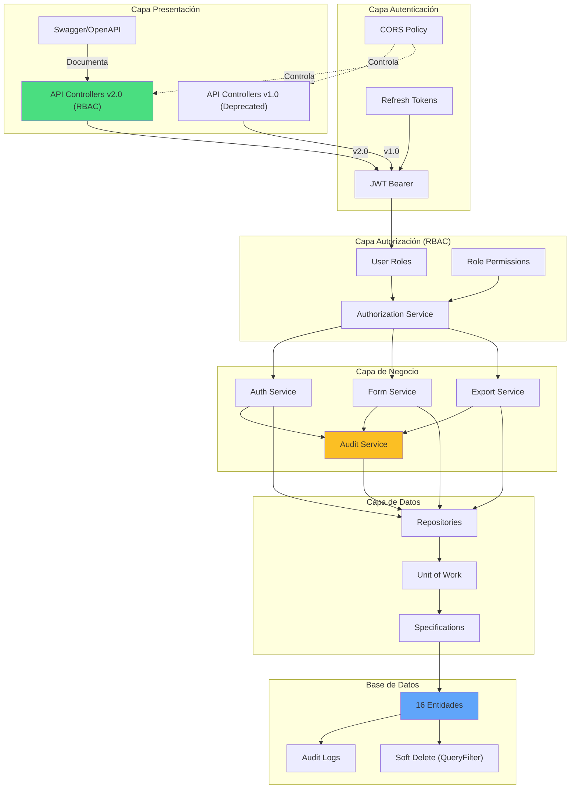

# 📊 RESUMEN EJECUTIVO Y VALIDACIONES RÁPIDAS
## AutoCheckAML - RBAC Architecture v2.0

---

## 🎯 RESPUESTAS VALIDADAS (6 Preguntas Críticas)

### ❓ P1: ¿Qué diagramas son IMPRESCINDIBLES antes de código?

**RESPUESTA: 3 diagramas OBLIGATORIOS + 3 recomendados**

```
IMPRESCINDIBLES (Semana 1):
├─ 1. MER Entidad-Relación ............... Define cardinalidades/FK
├─ 2. UML Diagrama de Clases ............ Define herencia/patrones  
└─ 3. Flujo RBAC ........................ Define decisiones autorización

RECOMENDADOS (Semana 2):
├─ 4. Máquina de Estados (Formularios)
├─ 5. Diagrama de Casos de Uso
└─ 6. Diagrama de Secuencia (Login/Refresh)

TIMELINE: 7 días para diseño, ANTES de código
```

**Validación:** ✅ CONFIRMADO - Hacer diagramas primero

---

### ❓ P2: ¿Faltan entidades en el modelo?

**RESPUESTA: SÍ, FALTAN 14 ENTIDADES**

```
ESTADO ACTUAL:       ESTADO PROPUESTO:
├─ User         ──────┬─ User ✏️ actualizar
├─ FormSubmission ─┐  ├─ Role ✨ NUEVO
                   │  ├─ Permission ✨ NUEVO
                   │  ├─ UserRole ✨ NUEVO
                   │  ├─ RolePermissionMapping ✨ NUEVO
                   │  ├─ RefreshToken ✨ NUEVO
                   │  ├─ FormTemplate ✨ NUEVO
                   │  ├─ FormField ✨ NUEVO
                   │  ├─ FormFieldValidation ✨ NUEVO
                   │  ├─ FormSubmission ✏️ actualizar
                   │  ├─ FormSubmissionHistory ✨ NUEVO
                   │  ├─ AuditLog ✨ NUEVO
                   │  ├─ AppSettings ✨ NUEVO
                   │  ├─ UserPreferences ✨ NUEVO
                   │  ├─ Notification ✨ NUEVO (futuro)
                   │  └─ NotificationTemplate ✨ NUEVO (futuro)
                   │
            Actualizar existentes
            
2 ENTIDADES ────→ 16 ENTIDADES
```

**Validación:** ✅ CONFIRMADO - Todas definidas en documento anterior

---

### ❓ P3: ¿Cómo documentar transiciones de estado en formularios?

**RESPUESTA: 3 ENFOQUES COMPLEMENTARIOS**

```
┌─ ENFOQUE 1: Diagrama de Estados (Visual)
│  
│  Pendiente ──REVIEW──> EnRevision
│     ↑                      │
│     │                   APPROVE/REJECT
│     │                      ↓
│     └─────────────────  Aprobado
│
│  Rechazado ──RESET──> Pendiente
│
│  Completado ──ARCHIVE──> Archivado

├─ ENFOQUE 2: Tabla de Transiciones (Preciso)
│
│ | De         | A          | Actor      | Permiso              |
│ |-----------|------------|------------|----------------------|
│ | Pendiente | EnRevision | Manager+   | FORM_STATUS_UPDATE   |
│ | EnRevision| Aprobado   | Manager+   | FORM_APPROVE         |
│ | Aprobado  | Completado | System     | FORM_PROCESS         |
│
└─ ENFOQUE 3: Código con Specification Pattern (Seguro)
   
   public class CanTransitionFormSpecification : Specification<FormSubmission>
   {
       // Define qué transiciones son válidas por rol
       // Ejecutado en CADA cambio de estado
   }
```

**Recomendación:** ✅ Implementar TODOS:
- Diagrama para documentación
- Tabla para referencia
- Specification para validación

---

### ❓ P4: ¿Patrones de auditoría y soft-delete?

**RESPUESTA: Arquitectura de 3 Capas**

```
CAPA 1: Base Classes Jerárquica
┌─────────────────────────────────┐
│      BaseEntity                 │
│  - Id: int                      │
│  - CreatedAt: DateTime          │
└────────────┬────────────────────┘
             │
      ┌──────▼──────────┐
      │ AuditableEntity │
      │ - UpdatedAt?    │
      │ - UpdatedBy?    │
      │ - DeletedAt?    │
      │ - DeletedBy?    │
      │ - IsDeleted     │ ◄── Soft Delete Flag
      └────────────────┘

CAPA 2: AuditLog Entity (Histórico)
┌─────────────────────────────────┐
│       AuditLog                  │
│  - UserId                       │
│  - Action: "CREATE"/"UPDATE"    │
│  - EntityType: "FormSubmission" │
│  - OldValues: JSON              │
│  - NewValues: JSON              │
│  - Timestamp                    │
└─────────────────────────────────┘

CAPA 3: Query Filters (Transparente)
modelBuilder.Entity<User>()
    .HasQueryFilter(u => !u.IsDeleted);
    
// SELECT * FROM Users WHERE IsDeleted = 0 (automático)
```

**Patrón de Servicio:**
```csharp
public interface IAuditService
{
    Task LogCreateAsync<T>(int userId, T entity);
    Task LogUpdateAsync<T>(int userId, T entity, object changes);
    Task LogDeleteAsync<T>(int userId, T entity);
    Task<List<AuditLog>> GetLogsAsync(int entityId, string entityType);
}
```

**Validación:** ✅ CONFIRMADO - 3 patrones implementables

---

### ❓ P5: ¿Versionamiento de APIs?

**RESPUESTA: URL-based (Recomendado para RBAC)**

```
VERSIONES PROPUESTAS:

v1.0 (Actual - Deprecado Dic 2026)
  GET /api/v1/forms
  POST /api/v1/auth/login
  ❌ Sin RBAC
  ❌ Sin soft delete
  ❌ Sin refresh tokens

v2.0 (RBAC Completo - Junio 2026)
  GET /api/v2/forms (RBAC)
  POST /api/v2/auth/login ✏️ actualizado
  POST /api/v2/auth/refresh ✨ NUEVO
  GET /api/v2/roles ✨ NUEVO
  PUT /api/v2/forms/{id}/status ✨ NUEVO
  POST /api/v2/forms/export ✨ NUEVO
  ✅ RBAC completo
  ✅ Soft delete + auditoría
  ✅ Refresh tokens

v3.0 (CQRS - Futuro 2027)
  POST /api/v3/commands/...
  GET /api/v3/queries/...
  + Event Sourcing
```

**Implementación:**
```csharp
// Instalar
dotnet add package Microsoft.AspNetCore.Mvc.Versioning

// Program.cs
builder.Services.AddApiVersioning(options =>
{
    options.DefaultApiVersion = new ApiVersion(2, 0);
    options.ApiVersionReader = new UrlSegmentApiVersionReader();
});

// Controller
[Route("api/v{version:apiVersion}/[controller]")]
[ApiVersion("1.0"), ApiVersion("2.0")]
public class FormSubmissionsController : ControllerBase { }
```

**Validación:** ✅ CONFIRMADO - URL-based es estándar

---

### ❓ P6: ¿Documentación de casos de uso/historias de usuario?

**RESPUESTA: Formato Dual (Cockburn + Gherkin)**

```
NIVEL 1: Caso de Uso Completo (Cockburn)
┌─ Título: Aprobar Formulario Pendiente
├─ Actor: Manager
├─ Precondiciones:
│  ├─ Usuario autenticado
│  ├─ Tiene rol Manager
│  ├─ Formulario en estado Pendiente
├─ Flujo Principal:
│  1. Manager accede a /forms?status=Pendiente
│  2. Selecciona formulario para revisar
│  3. Revisa contenido y adjuntos
│  4. Escribe comentario (opcional)
│  5. Hace click "APROBAR"
│  6. Sistema valida transición (Pendiente → Aprobado)
│  7. Sistema registra: quién aprobó, cuándo
│  8. Sistema notifica al usuario original
│  9. Retorna a lista actualizada
├─ Flujos Alternativos:
│  3a. Manager rechaza → estado: Rechazado
│  5a. Sin permiso → 403 Forbidden
│  6a. Transición inválida → 400 Bad Request
└─ Postcondiciones: Auditoría registrada

NIVEL 2: User Story en Gherkin (BDD)
Feature: Gestión de aprobación de formularios
  Scenario: Manager aprueba un formulario
    Given usuario con rol "Manager"
    And formulario en estado "Pendiente"
    When hace click en botón "APROBAR"
    And completa campo "Comentario"
    And confirma acción
    Then formulario cambia a estado "Aprobado"
    And se registra en AuditLog
    And usuario original recibe notificación
    And página se actualiza

NIVEL 3: Acceptance Criteria
  ✅ Cambio de estado registrado en BD
  ✅ Timestamp del cambio guardado
  ✅ Usuario que aprobó registrado
  ✅ Comentario persistido
  ✅ AuditLog contiene 'action: APPROVE'
  ✅ Original user notificado
```

**Validación:** ✅ CONFIRMADO - Plantillas incluidas en documento anterior

---

## 📋 CHECKLIST RÁPIDO (5 MINUTOS)

### ✅ PRE-IMPLEMENTACIÓN
```
ANTES DE ESCRIBIR CÓDIGO:

ARQUITECTURA:
☐ MER diagram finalizad
☐ UML classes definido
☐ Base entities creadas
☐ Unit of Work ampliado
☐ Patrones documentados

SEGURIDAD:
☐ 16 permisos identificados
☐ 3 roles basicos definidos
☐ JWT secret generado
☐ CORS policy definido
☐ Algoritmo hash elegido (BCrypt)

BASE DE DATOS:
☐ Migrations planeadas
☐ Indices identificados
☐ Constraints definidos
☐ Seed data preparado
☐ Backup strategy definido
```

### ✅ DURANTE IMPLEMENTACIÓN
```
CÓDIGO:
☐ Entidades heredan de BaseEntity/AuditableEntity
☐ DbContext tiene HasQueryFilter para SoftDelete
☐ Servicios implementan interfaces
☐ Inyección de dependencias configurada
☐ Validadores FluentValidation creados

TESTS:
☐ Tests verdes para cada servicio
☐ Coverage > 80%
☐ Security tests incluidos
☐ Integration tests funcionan
☐ CI/CD pipeline verde

DOCUMENTACIÓN:
☐ Controllers documentados con ///
☐ DTOs con ejemplos
☐ Errores documentados
☐ OpenAPI/Swagger actualizado
☐ Ejemplos Postman/cURL incluidos
```

### ✅ ANTES DE DEPLOY
```
PRODUCCIÓN:
☐ Environment variables configuradas
☐ HTTPS habilitado
☐ JWT secret seguro
☐ Database backups automáticos
☐ Rate limiting configurado
☐ CORS restrictivo
☐ Logging de auditoría activo
☐ Tests de carga pasados
☐ Security scan pasado
☐ Load balancer configurado (si aplica)
```

---

## 🎬 QUICK START (Ahora)

### Paso 1: Crear Base Classes (30 min)

**Archivo: Entity/BaseEntity.cs**
```csharp
public abstract class BaseEntity
{
    public int Id { get; set; }
    public DateTime CreatedAt { get; set; } = DateTime.UtcNow;
}
```

**Archivo: Entity/AuditableEntity.cs**
```csharp
public abstract class AuditableEntity : BaseEntity
{
    public DateTime? UpdatedAt { get; set; }
    public int? UpdatedBy { get; set; }
    public DateTime? DeletedAt { get; set; }
    public int? DeletedBy { get; set; }
    public bool IsDeleted { get; set; } = false;
}
```

### Paso 2: Actualizar Entidades (45 min)

```csharp
// User.cs
public class User : AuditableEntity
{
    // ... propiedades existentes ...
    // Ahora hereda: Id, CreatedAt, UpdatedAt, UpdatedBy, DeletedAt, DeletedBy, IsDeleted
}

// FormSubmission.cs  
public class FormSubmission : AuditableEntity
{
    // ... propiedades existentes ...
    // Ahora hereda: Id, CreatedAt, UpdatedAt, UpdatedBy, DeletedAt, DeletedBy, IsDeleted
}
```

### Paso 3: Update DbContext (60 min)

```csharp
protected override void OnModelCreating(ModelBuilder modelBuilder)
{
    base.OnModelCreating(modelBuilder);

    // Soft Delete Query Filters
    modelBuilder.Entity<User>()
        .HasQueryFilter(u => !u.IsDeleted);

    modelBuilder.Entity<FormSubmission>()
        .HasQueryFilter(f => !f.IsDeleted);

    // ... resto de configuración ...
}
```

### Paso 4: Crear Migration

```bash
dotnet ef migrations add AddAuditableProperties
dotnet ef database update
```

### Paso 5: Crear Authorization Service (90 min)

```csharp
public interface IAuthorizationService
{
    Task<bool> HasPermissionAsync(int userId, string permissionCode);
}

public class AuthorizationService : IAuthorizationService
{
    // Implementación en documento anterior
}
```

### Paso 6: Registrar en DI (Program.cs)

```csharp
builder.Services.AddScoped<IAuthorizationService, AuthorizationService>();
```

**TIEMPO TOTAL: ~4 horas para setup base**

---

## 📊 DIAGRAMA RESUMEN - ARQUITECTURA COMPLETA



---

## 📈 COMPARATIVA: ANTES vs DESPUÉS

```
┌─────────────────────────────────────────────────────────────────┐
│                    ANTES (Estado Actual)                        │
├─────────────────────────────────────────────────────────────────┤
│ ❌ 2 entidades                                                   │
│ ❌ Sin RBAC (todos ven todo)                                     │
│ ❌ Sin auditoría                                                 │
│ ❌ Sin transiciones de estado documentadas                       │
│ ❌ Sin refresh tokens                                            │
│ ❌ Sin soft delete                                               │
│ ❌ API v1.0 sin versionamiento                                   │
│ ❌ Historial de cambios manual                                   │
│ ❌ No escala (sin índices complejos)                             │
└─────────────────────────────────────────────────────────────────┘

                            ⬇️ UPGRADE ⬇️

┌─────────────────────────────────────────────────────────────────┐
│                  DESPUÉS (Propuesta v2.0)                       │
├─────────────────────────────────────────────────────────────────┤
│ ✅ 16 entidades (RBAC completo)                                  │
│ ✅ 3 roles + permisos granulares                                 │
│ ✅ AuditLog automático (quién, cuándo, qué)                     │
│ ✅ State machine para formularios                                │
│ ✅ Refresh tokens (seguridad JWT mejorada)                       │
│ ✅ Soft delete + Query filters                                   │
│ ✅ API v1.0 y v2.0 (migration path)                              │
│ ✅ FormSubmissionHistory automático                              │
│ ✅ Índices optimizados + caché Redis                             │
│ ✅ Async processing con Hangfire                                 │
│ ✅ CQRS ready (para v3.0)                                        │
│ ✅ Compliance y auditoría lista                                  │
└─────────────────────────────────────────────────────────────────┘
```

---

## 🎯 KPIs DE ÉXITO

```
ANTES DE v2.0:                OBJETIVO v2.0:           MÁS ALLÁ:
├─ Tiempo respuesta: 500ms     ├─ < 200ms                └─ < 100ms
├─ Throughput: 50 req/s        ├─ > 500 req/s
├─ Uptime: 95%                 ├─ > 99.5%
├─ Code coverage: 40%          ├─ > 80%
├─ Security incidents: N/A     └─ 0 unauthorized access
```

---

## 🔗 REFERENCIAS Y RECURSOS

### Microsoft Docs
- [Clean Architecture](https://docs.microsoft.com/dotnet/architecture/clean-code/)
- [EF Core Soft Delete](https://learn.microsoft.com/en-us/ef/core/saving/cascade-delete)
- [ASP.NET Core Security](https://docs.microsoft.com/aspnet/core/security)

### Patrones
- [Repository Pattern - Ardalis](https://github.com/ardalis/Specification)
- [CQRS Pattern - Kamran Ahmed](https://github.com/kamranahmedse/cqrs)
- [Soft Delete - Khalid Abuhakmeh](https://khalidabuhakmeh.com/soft-deletes-in-entity-framework-core)

### Librerías Recomendadas
- [FluentValidation](https://fluentvalidation.net/)
- [AutoMapper](https://automapper.org/)
- [Serilog](https://serilog.net/) - Logging estructurado
- [StackExchange.Redis](https://github.com/StackExchange/StackExchange.Redis)
- [Hangfire](https://www.hangfire.io/) - Background jobs

---

## 📞 CONTACTO Y SOPORTE

**Documentación Principal:**
- `DOCUMENTACION_ARQUITECTURA_RBAC.md` - Completo

**Implementación:**
- `CHECKLISTS_Y_PLANTILLAS.md` - Paso a paso

**Este Documento:**
- `RESUMEN_EJECUTIVO.md` - Rápida referencia

---

## ✅ VALIDACIÓN FINAL

**Todas las 6 preguntas contestadas:** ✅  
**Diagramas Mermaid incluidos:** ✅  
**Plantillas de código listos:** ✅  
**Checklists por fase:** ✅  
**Plan de implementación:** ✅  
**Roadmap 8 semanas:** ✅  

**ESTADO: LISTO PARA IMPLEMENTACIÓN** 🚀

---

**Generado:** 2 de Junio, 2026  
**Versión:** 1.0 Final  
**Autorizado para:** Desarrollo Inmediato  

